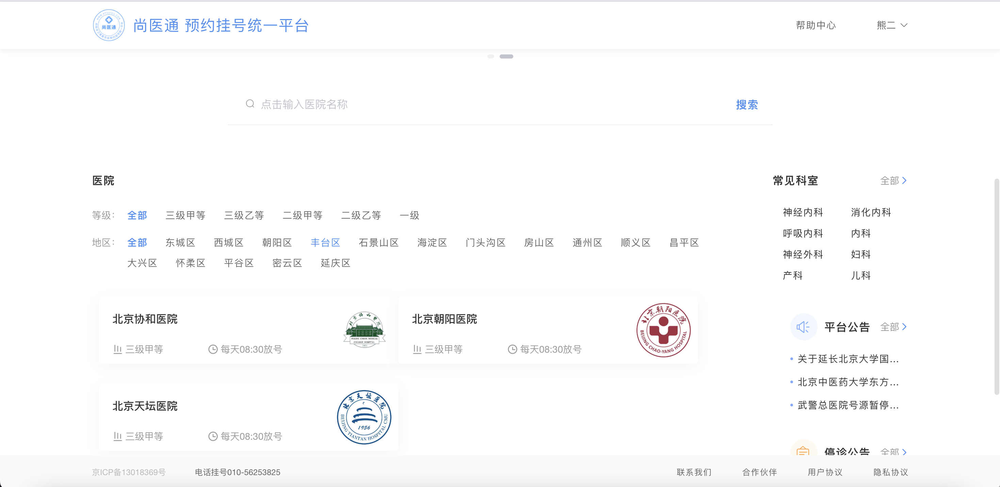
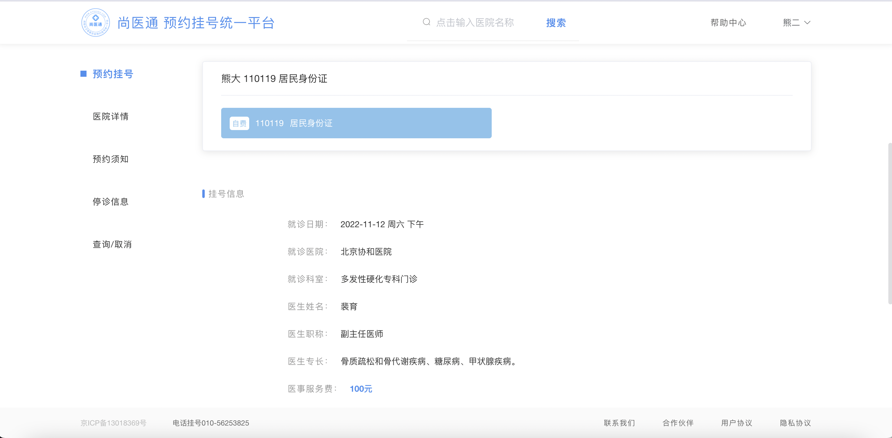
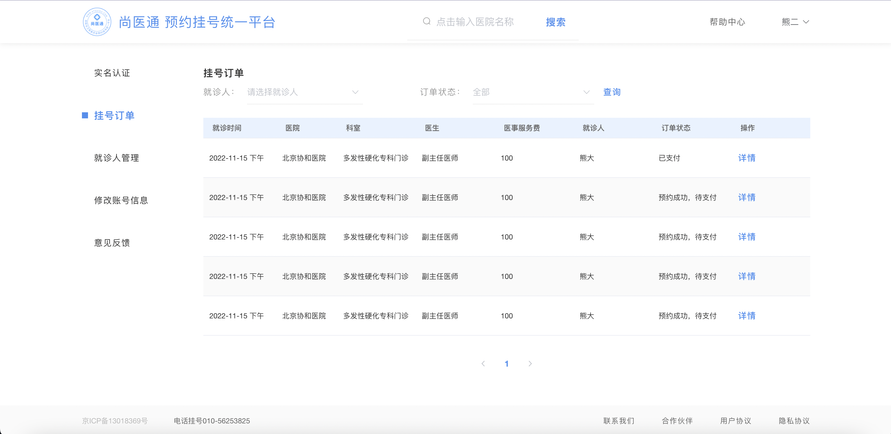
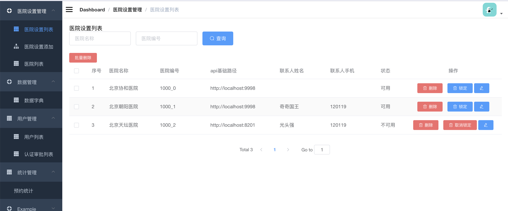
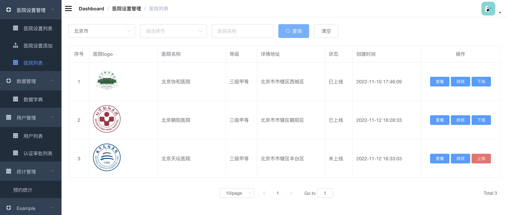
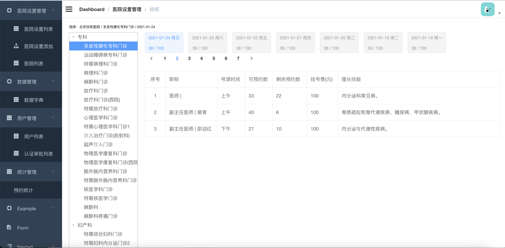
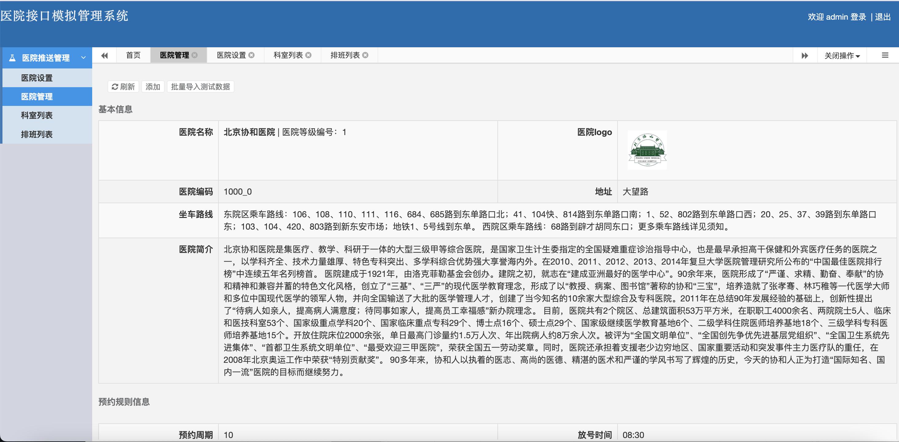
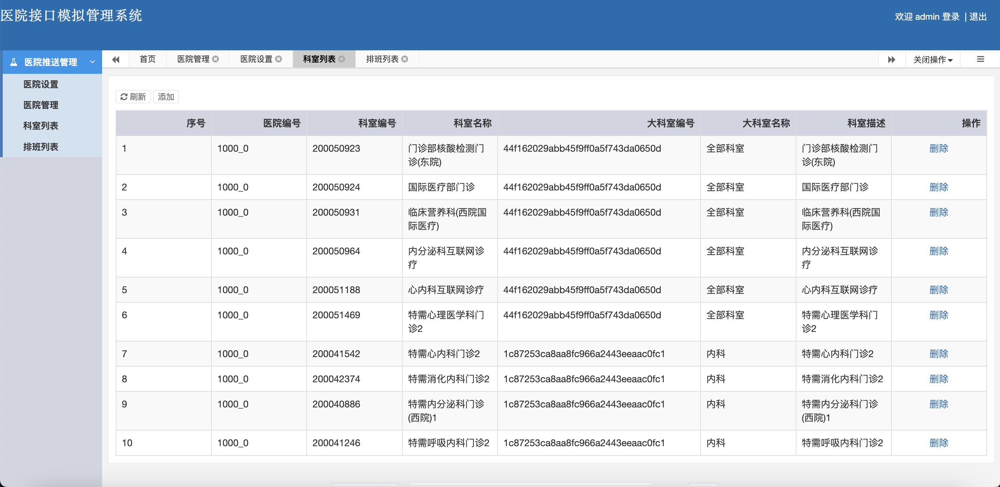
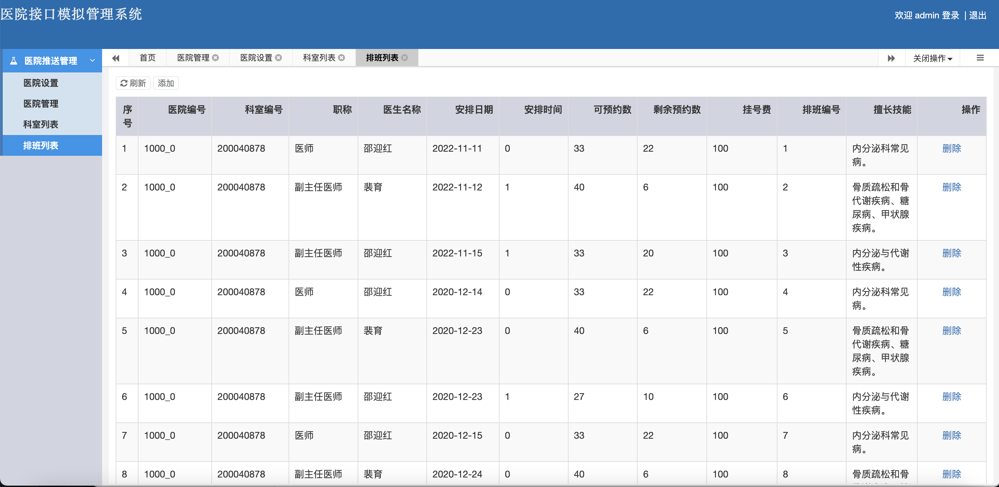

# syt

##  Introduction:

`syt` is an hospital online appointment system. In the past, patients had to go to hospital with no appointment and wait for several hours to meet their doctors. With the help of syt, patients can make an appointment with their doctors before meeting and they will not need to wait for long time. 

### Project Details

#### Backend System

yygh_parent is the backend of syt and includes all backend services of syt, such as patient services, order services, statistic services and spring gateway services. It connnects database and makes operations on database for frontend.

#### Hospital online appointment platform

yygh-site is a vue project and aims to help  patients  make appointment with their doctors. Patients can search for hospital and department on the website and choose the doctor they need to meet. 

#### Hospital management System for the platform:

vue-admin-template-master is a vue project and aims to help hospital online appointment platform manager to manage hospital and users information.

#### Hospital management System for the hospital:

Hospital-manage is a vue hospital management system . It aims to help hospital manager to manage hospital . Hospital managers can upload their hospital set , department and schedule information to database.They can also show information of hospital set, department and schedule.

### Techiques

#### Backend Technique

| Technique     | Detail         | Official Website                           |
| :------------------- | ------------------- | ---------------------------------------------- |
| SpringBoot           | 容器+MVC框架           | https://spring.io/projects/spring-boot         |
| SpringCloud          | 网关                  | https://spring.io/projects/spring-boot         |
| MyBatis              | ORM框架             | http://www.mybatis.org/mybatis-3/zh/index.html |
| RabbitMQ             | 消息队列            | https://www.rabbitmq.com/                      |
| Redis                | 分布式缓存          | https://redis.io/                              |
| MongoDB              | NoSql数据库         | https://www.mongodb.com                        |
| Nginx                | 静态资源服务器      | https://www.nginx.com/                         |
| Docker               | 应用容器引擎        | https://www.docker.com                         |
| OSS                  | 对象存储            | https://github.com/aliyun/aliyun-oss-java-sdk  |
| JWT                  | JWT登录支持         | https://github.com/jwtk/jjwt                   |
| Lombok               | 简化对象封装工具    | https://github.com/rzwitserloot/lombok         |
| Swagger-UI           | 文档生成工具        | https://github.com/swagger-api/swagger-ui      |

#### Frontend Technique

| 技术       | 说明                  | 官网                                   |
| ---------- | --------------------- | :------------------------------------- |
| Vue        | 前端框架              | https://vuejs.org/                     |
| Vue-router | 路由框架              | https://router.vuejs.org/              |
| Element    | 前端UI框架            | https://element.eleme.io               |
| Axios      | 前端HTTP框架          | https://github.com/axios/axios         |
| Nuxt       | 前端轻量级应用框架     | https://zh.nuxtjs.org/                 |

#### Architecture diagram：

##### Technical Architecture Diagram

##### Business Architecture Diagram

